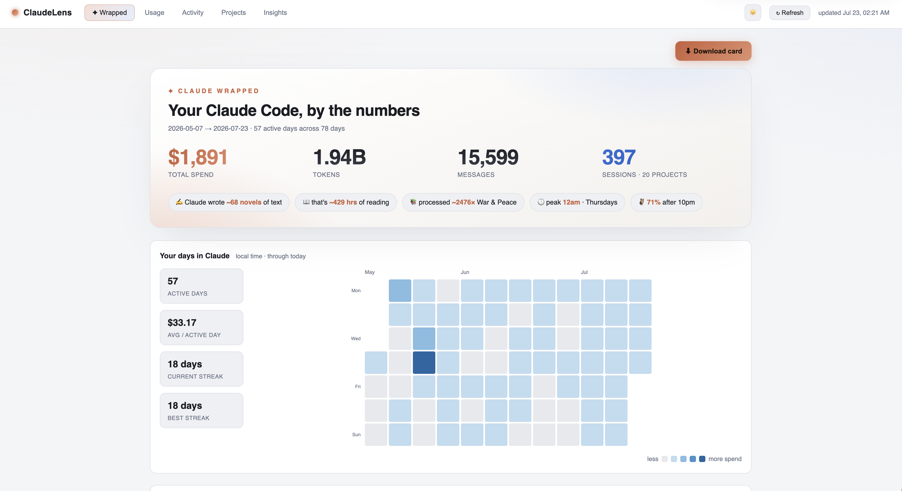
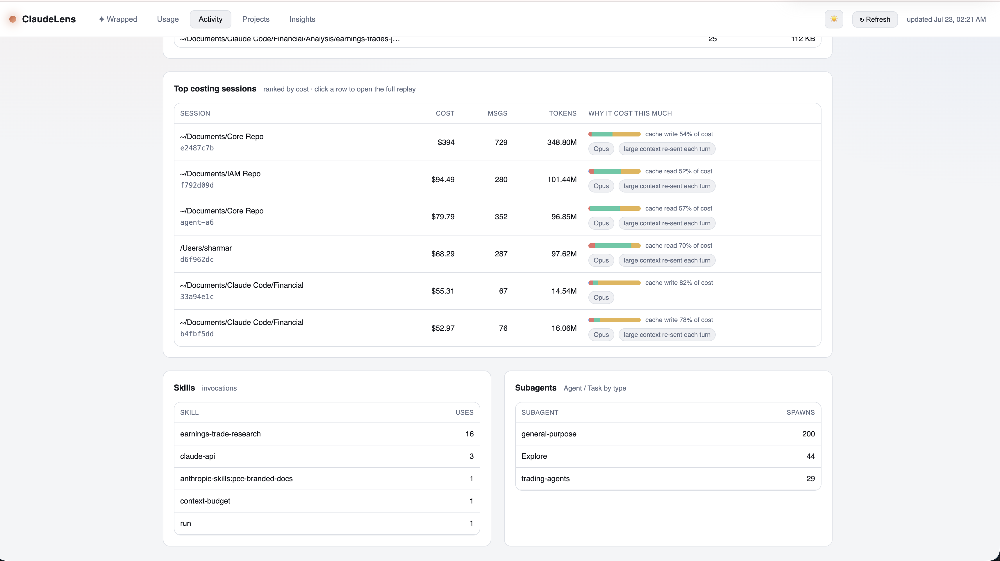
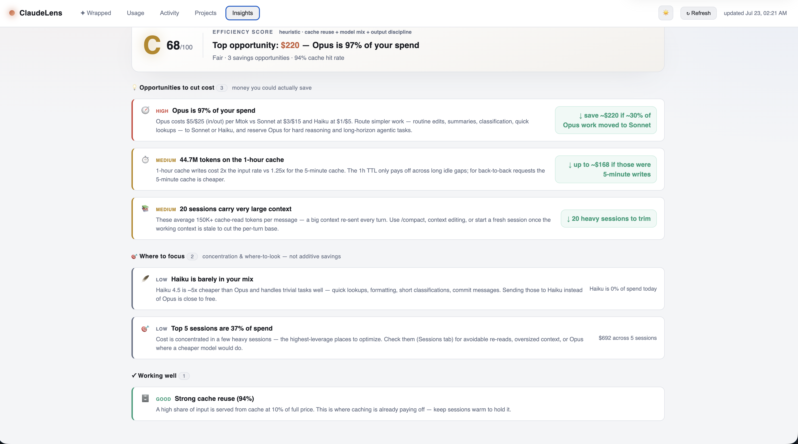

# ClaudeLens 🧾

> **Runs 100% locally.** Reads your `~/.claude` logs on your own machine and serves the dashboard from a tiny local Python server. No cloud, no telemetry, no API key.

See where your Claude Code tokens actually go: cost estimates, a shareable "Wrapped" card, and blunt advice on what to cut.



## Quick start

```bash
git clone https://github.com/arush361/ClaudeLens.git
cd ClaudeLens
python3 app.py
```

Open <http://127.0.0.1:5000>. That's it — Python 3.9+, nothing to install.

Different port: `python3 app.py --port 5057`. Hit **↻ Refresh** after new activity to re-parse — no restart needed. Toggle 🌙/☀️ in the header for light/dark mode.

## What's inside

- **✦ Wrapped** — headline stats, fun analogies, a cost-shaded activity calendar with a streak/active-days summary, and a Records & superlatives grid. Export as a PNG.
- **Usage** — cost + sessions, filterable by project and date range. Click a session for a full turn-by-turn replay.
- **Activity** — most-used tools, file hotspots, skills/subagents, and a **top costing sessions** table showing exactly where each session's dollars went (input/output/cache read/cache write).
- **Projects** — spend by working directory.
- **Insights** — an efficiency grade plus quantified, ranked ways to cut cost (model routing, cache misses, bloated context).




## About the numbers

Costs are **estimates** from each message's `usage` object, priced at published Claude rates (`pricing.py`). Notably:

- Dedupes on `message.id` — one assistant message can appear across multiple log lines with the same usage; it's counted once, not once per line.
- Prices each of the five disjoint token buckets at its own rate (input, output, cache read ×0.10, cache write 5m ×1.25, cache write 1h ×2.0) — nothing is double-counted or approximated with an average.
- Local time for daily/hourly views; logs are UTC.

Edit `pricing.py` to tweak rates — since the warehouse stores raw token buckets, not dollar amounts, a rate change re-prices all history on next load.

## History that outlives the logs

Claude Code prunes `~/.claude` session logs after ~30 days. ClaudeLens keeps a local SQLite warehouse at `~/.claude-cost/history.db` so totals survive after the source logs are gone. It's incremental (only changed files get re-parsed) and lives outside the repo — point it elsewhere with `--db` or `$CLAUDE_COST_DB`, or delete it to rebuild.

## Fine print

Chart.js and html2canvas load from a CDN, so the page needs internet on first load. Your usage data itself never leaves your machine.
