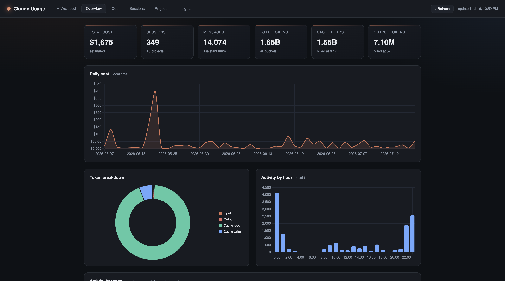
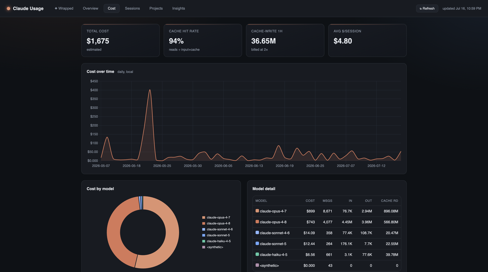

# Claude-Cost 🧾

Ever wonder where all your Claude Code tokens *actually* go? Same.

Claude-Cost is a local-first dashboard that reads your `~/.claude` session logs and turns them into cost estimates, pretty charts, a shareable "Claude Wrapped" card, and blunt advice on how to stop lighting money on fire.

No cloud. No telemetry. No API key. No `npm install` sadness. Just Python's standard library and your own data, staying on your own machine.


## Quick start

```bash
git clone https://github.com/arush361/Claude-Cost.git
cd Claude-Cost
python3 app.py
```

Open <http://127.0.0.1:5000> and you're in. That's it. (Python 3.9+, nothing to install.)

Pick a different port if 5000 is busy:

```bash
python3 app.py --port 5057
```

Hit **↻ Refresh** in the top-right after some Claude Code activity to re-parse and reload. No restart needed.

## What's inside

- **✦ Wrapped** — your Spotify-Wrapped-but-for-tokens. Headline stats, fun analogies ("Claude wrote ~59 novels of text"), a GitHub-style activity calendar, and a **Records & superlatives** grid (priciest day, marathon session, biggest single message, model of choice...). Smash the **Download card** button to export it as a PNG and flex on your timeline.
- **Overview** — spend, sessions, messages, tokens, daily trend, and a real weekday × hour activity heatmap.
- **Cost** — cost over time, cost by model, cache hit rate, per-model breakdown.
- **Sessions** — every session, searchable and sortable. Click one for a full turn-by-turn replay with per-turn cost and context-compaction markers.
- **Projects** — spend grouped by the actual working directory.
- **Insights** — an efficiency grade plus ranked, quantified ways to cut cost (route Opus work to Sonnet, fix cache misses, trim bloated context...). Savings are labeled separately from "where to look" signals, because those two are not the same number.





## About the numbers

Costs are **estimates** from the token counts in each message's `usage`, priced with the current published Claude rates (see `pricing.py`). A few things it gets right that a naive script wouldn't:

- **Dedupes on `message.id`.** One assistant message is split across many log lines with the *same* usage repeated on each. Summing per line would multiply your cost by the number of content blocks. It doesn't.
- **Disjoint token buckets**, each priced at its own rate: input ×1.0, output ×1.0, cache read ×0.10, cache write 5m ×1.25, cache write 1h ×2.0.
- **Local time** for daily/hourly buckets (logs are UTC). **Sonnet 5** priced at standard $3/$15. `<synthetic>` and unknown models don't get silently priced at $0.

Want to tweak rates or add a model? It's all in `pricing.py`.

## The fine print

Two `<script>` tags load from a CDN (Chart.js for charts, html2canvas for the PNG export), so the *page* needs internet on first load. Your usage data never leaves your machine.

Inspired by the idea behind local-first Claude analytics. Built for fun. Bring your own tokens.
