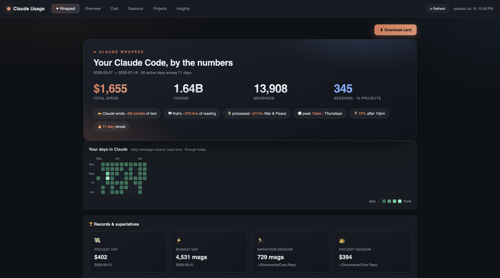
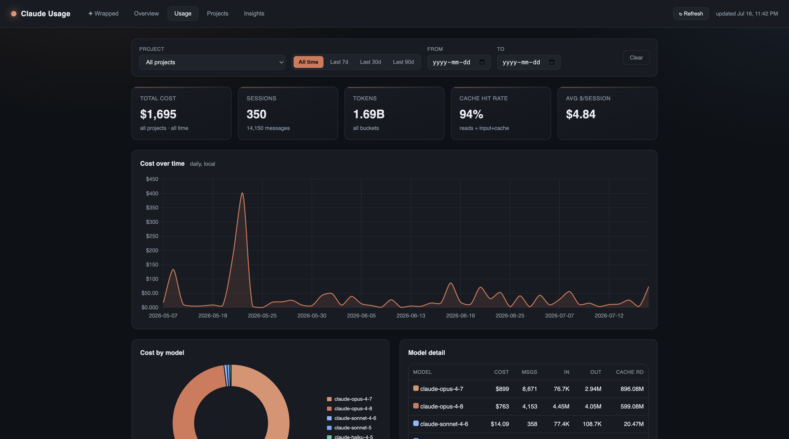
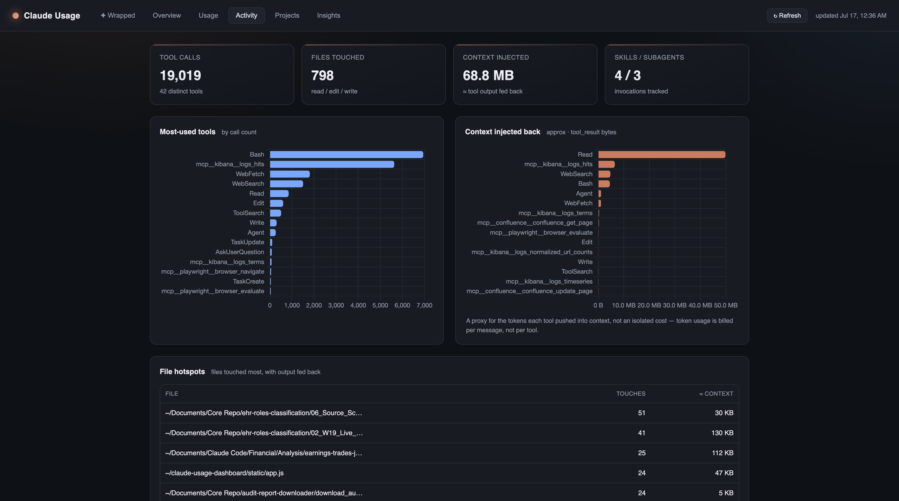
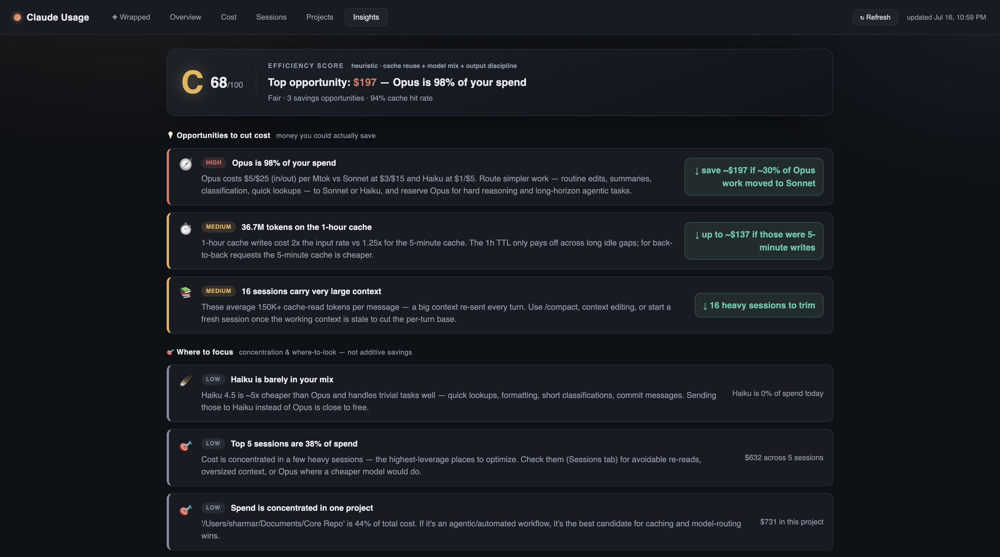
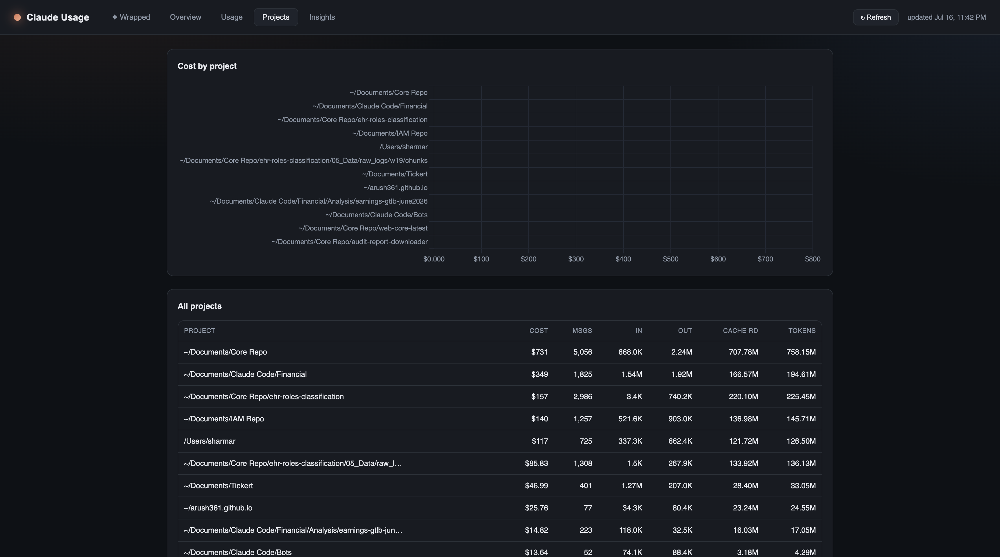

# ClaudeLens 🧾

> **Runs 100% locally.** It reads your `~/.claude` logs on your own machine, serves the dashboard from a tiny local Python server, and never sends your data anywhere. No cloud, no telemetry, no API key.

Ever wonder where all your Claude Code tokens *actually* go? Same.

ClaudeLens is a local-first dashboard that reads your `~/.claude` session logs and turns them into cost estimates, pretty charts, a shareable "Claude Wrapped" card, and blunt advice on how to stop lighting money on fire.

No cloud. No telemetry. No API key. No `npm install` sadness. Just Python's standard library and your own data, staying on your own machine.



## Quick start

```bash
git clone https://github.com/arush361/ClaudeLens.git
cd ClaudeLens
python3 app.py
```

Open <http://127.0.0.1:5000> and you're in. That's it. (Python 3.9+, nothing to install.)

Pick a different port if 5000 is busy:

```bash
python3 app.py --port 5057
```

Hit **↻ Refresh** in the top-right after some Claude Code activity to re-parse and reload. No restart needed.

## What's inside

- **✦ Wrapped** — your Spotify-Wrapped-but-for-tokens. Headline stats, fun analogies ("Claude wrote ~59 novels of text"), a GitHub-style activity calendar (messages and cost side by side), and a **Records & superlatives** grid (priciest day, marathon session, biggest single message, model of choice...). Smash the **Download card** button to export it as a PNG and flex on your timeline.
- **Usage** — cost + sessions in one place, with **filters**: pick a project and/or a timeframe (Last 7d / 30d / 90d or a custom date range) and every chart, the model breakdown, and the session list all update together. Filtering is done server-side so the numbers stay correct, not just the visible rows. Click any session for a full turn-by-turn replay with per-turn cost and context-compaction markers.
- **Activity** — where your tokens actually go: most-used tools, a **file hotspots** table, skills, subagents, a **top costing sessions** breakdown (per-session cost split across input/output/cache read/cache write, so you can see exactly why a session got expensive), plus an *approximate* "context injected" meter (how many bytes each tool fed back into the conversation — a proxy for tokens, honestly labeled, not a fake per-tool bill).
- **Projects** — spend grouped by the actual working directory.
- **Insights** — an efficiency grade plus ranked, quantified ways to cut cost (route Opus work to Sonnet, fix cache misses, trim bloated context...). Savings are labeled separately from "where to look" signals, because those two are not the same number.






## About the numbers

Costs are **estimates** from the token counts in each message's `usage`, priced with the current published Claude rates (see `pricing.py`). A few things it gets right that a naive script wouldn't:

- **Dedupes on `message.id`.** One assistant message is split across many log lines with the *same* usage repeated on each. Summing per line would multiply your cost by the number of content blocks. It doesn't.
- **Disjoint token buckets**, each priced at its own rate: input ×1.0, output ×1.0, cache read ×0.10, cache write 5m ×1.25, cache write 1h ×2.0.
- **Local time** for daily/hourly buckets (logs are UTC). **Sonnet 5** priced at standard $3/$15. `<synthetic>` and unknown models don't get silently priced at $0.

Want to tweak rates or add a model? It's all in `pricing.py`. Because the warehouse stores raw token buckets (never a frozen dollar figure), editing a rate re-prices *all* your history the next time you load — even sessions whose logs are long gone.

## History that outlives the logs

Claude Code prunes its own `~/.claude` session logs after about 30 days. ClaudeLens keeps a tiny local **warehouse** at `~/.claude-cost/history.db` (a SQLite file) so your spend history sticks around after the raw logs disappear.

- **Persistent** — each message is ingested once, keyed on its stable id. When a log file gets pruned, its rows stay in the warehouse. Your all-time totals don't quietly shrink.
- **Incremental** — only session files whose size/mtime changed get re-parsed, so after the first run the dashboard loads in a fraction of a second (a fresh process warm-starts in ~0.5s) instead of re-reading hundreds of MB every time.
- **Yours** — it lives outside the repo and never leaves your machine. Point it elsewhere with `--db /path/to.db` or `$CLAUDE_COST_DB`, or just delete it to rebuild from whatever logs still exist.

## The fine print

Two `<script>` tags load from a CDN (Chart.js for charts, html2canvas for the PNG export), so the *page* needs internet on first load. Your usage data never leaves your machine.

Inspired by the idea behind local-first Claude analytics. Built for fun. Bring your own tokens.
